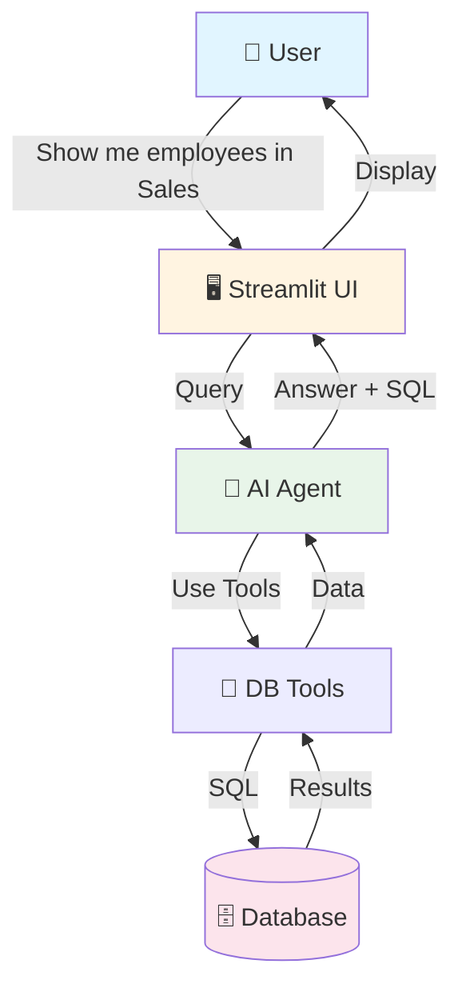
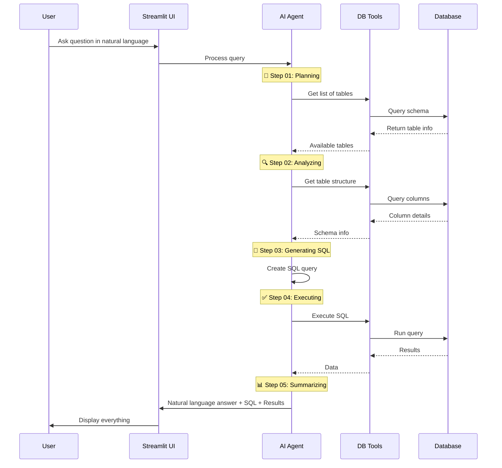
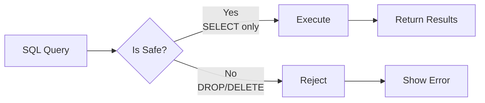
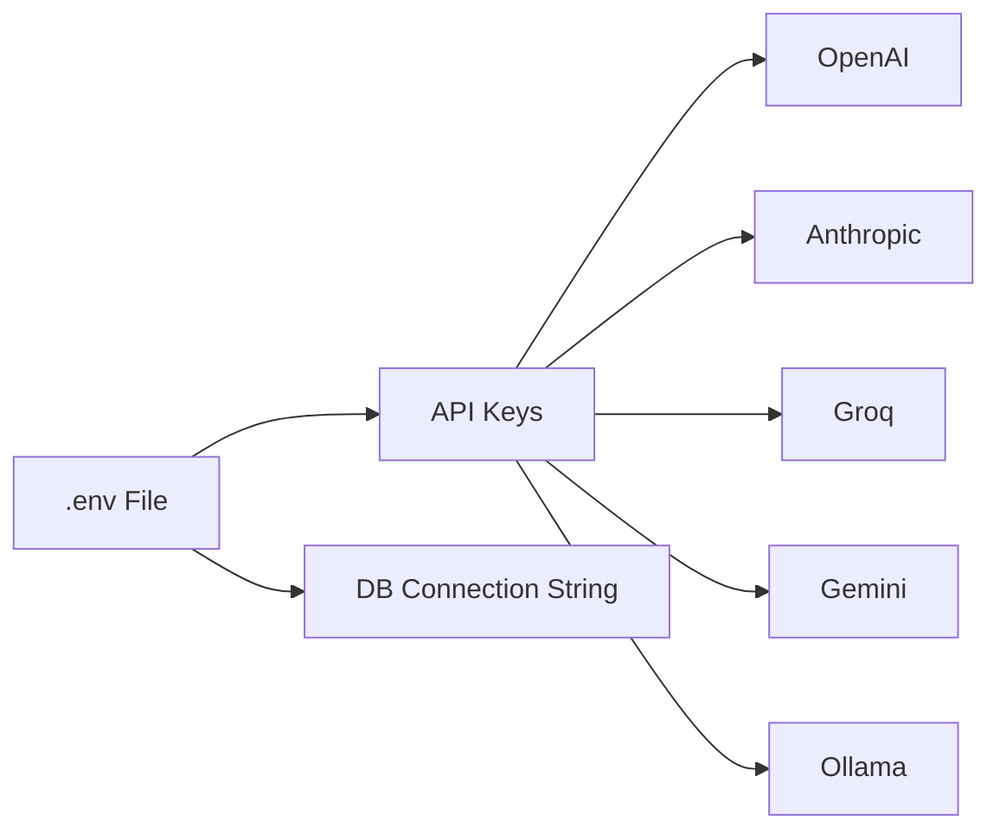

# NLDBQ Data Flow Diagram

## Overview

NLDBQ converts natural language questions into SQL queries using an AI agent that streams its reasoning steps in real-time.

## Simple Architecture



## How It Works



## Project Structure

### 4 Main Layers

1. **UI Layer** (`src/ui/`)
   - `app.py` - Main entry point
   - `chat.py` - Chat interface with live steps
   - `config.py` - LLM provider selection
   - `history.py` - Query history

2. **Agent Layer** (`src/agents/`)
   - `agent.py` - Creates and streams AI agent
   - `tools.py` - Database tools (list tables, get schema, execute SQL)

3. **Database Layer** (`src/db/`)
   - `db_client.py` - Database connections
   - `db_schema_wrapper.py` - Schema inspection helpers

4. **Config Layer** (`src/config/`)
   - `models.py` - LLM provider options
   - `prompt.py` - System prompts
   - `db_schema.py` - Schema definitions

## Data Flow Steps

```
User Question
    ↓
Session State (stores chat history)
    ↓
AI Agent (selects tools to use)
    ↓
DB Tools (safe SQL execution)
    ↓
Database (executes query)
    ↓
Results → Agent → Natural Language Answer
    ↓
Display to User
```

## Key Features

### Agent Steps Display
```
🔍 Agent Steps
01 📝 Planning next steps...
02 🔍 Executing: SELECT * FROM employees WHERE dept = 'Sales'
03 ✅ Found 23 results
04 📊 Summarizing findings...
```

### Session State
```javascript
{
  messages: [{role: "user", content: "..."}, {role: "assistant", content: "..."}],
  query_history: [{question: "...", sql: "...", timestamp: "..."}],
  agent: Agent,
  config: {thread_id: "conversation_1"}
}
```

### Available Tools
1. **list_tables()** - Get all database tables
2. **get_table_info(table)** - Get columns and types
3. **execute_sql(query)** - Run safe SELECT queries

## Safety Features



- Only `SELECT` queries allowed
- No `DROP`, `DELETE`, `UPDATE`, `INSERT`
- Schema inspection uses information_schema
- Connection pooling for efficiency

## Configuration



## Summary

**NLDBQ** = Natural Language → AI Agent → SQL → Results

The agent streams its thinking process so you can see:
- What it's doing
- What SQL it generates
- How many results it finds
- The final answer in plain English
