# NLDBQ Data Flow Diagram

## High-Level Architecture

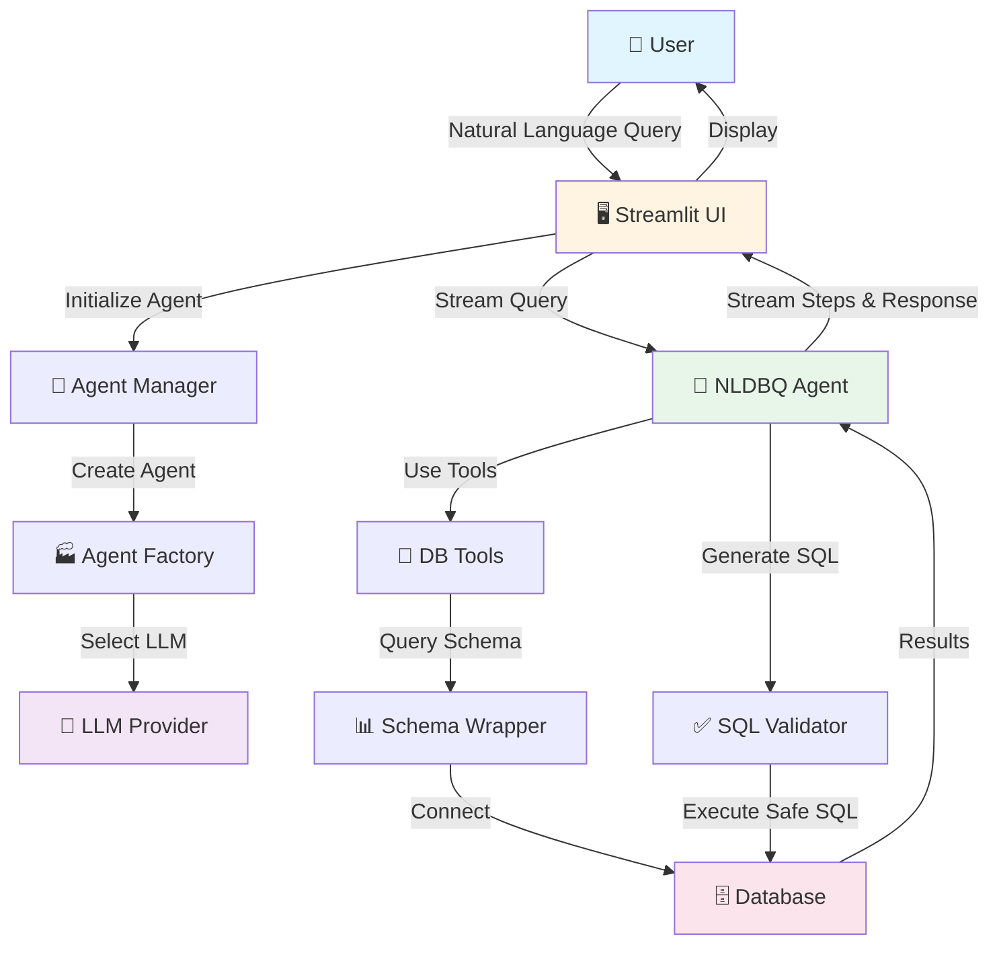

## Detailed Data Flow

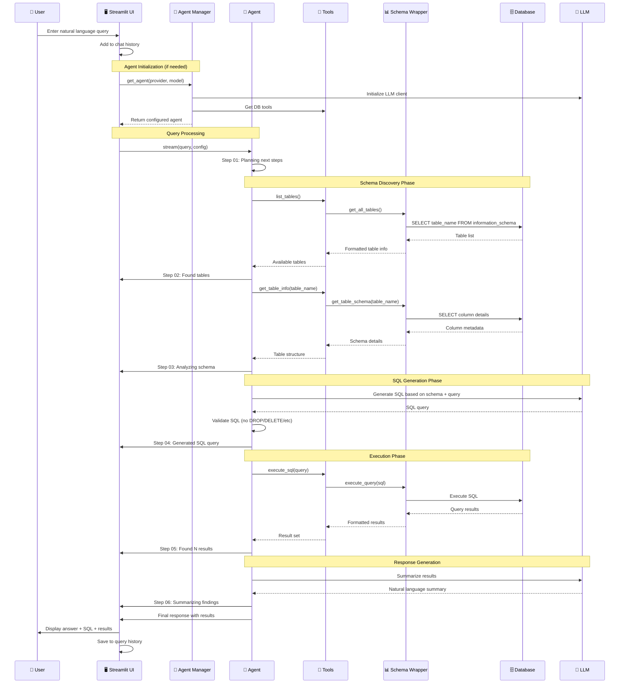

## Component Breakdown

### 1. **User Interface Layer** (`src/ui/`)
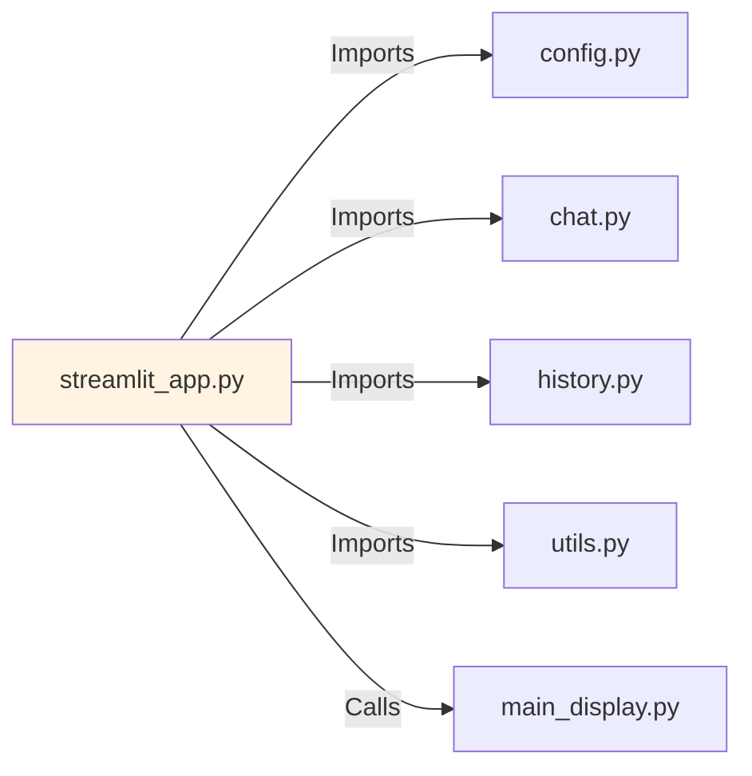

**Data Flow:**
- User input → Session state
- Session state → Agent manager
- Agent responses → UI components
- Query history → Sidebar display

### 2. **Agent Layer** (`src/agents/`)
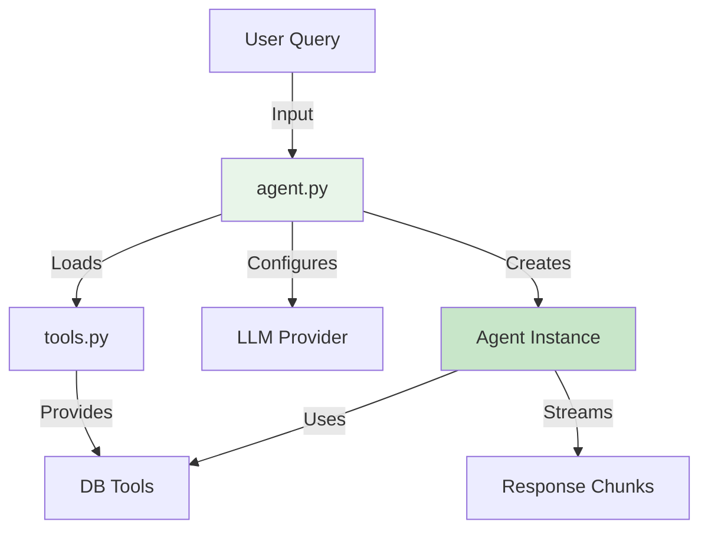

**Data Flow:**
- Natural language → Agent
- Agent → Tool selection
- Tools → Database operations
- Results → Natural language response

### 3. **Database Layer** (`src/db/`)
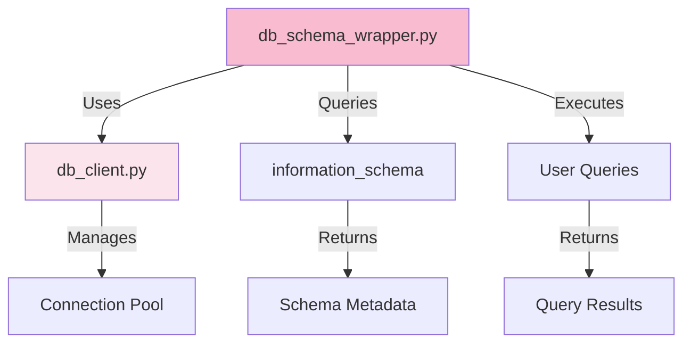

**Data Flow:**
- Schema requests → information_schema queries
- SQL execution → Database
- Results → Formatted output
- Connection management → Pool

### 4. **Configuration Layer** (`src/config/`)
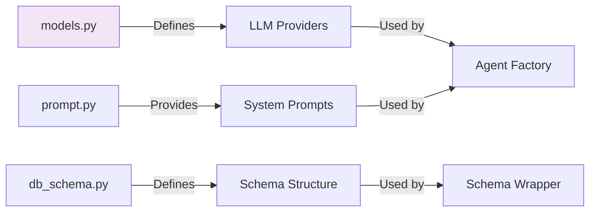

### 5. **Agent Steps Flow**
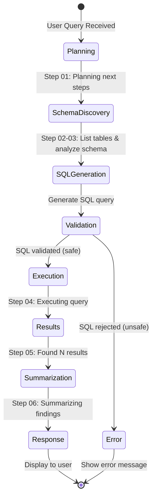

## Data Structures

### Query Processing Data Flow
```
Input: Natural Language String
  ↓
Agent State: {
  messages: [HumanMessage, AIMessage, ToolMessage],
  thread_id: "conversation_1",
  config: {...}
}
  ↓
Tool Calls: {
  name: "list_tables" | "get_table_info" | "execute_sql",
  args: {...},
  results: {...}
}
  ↓
LLM Response: {
  content: "Natural language answer",
  tool_calls: [...],
  type: "ai"
}
  ↓
Output: Formatted Response + SQL + Results
```

### Session State Structure
```
st.session_state = {
  messages: [
    {role: "user", content: "..."},
    {role: "assistant", content: "..."}
  ],
  query_history: [
    {
      question: "...",
      sql: "SELECT ...",
      timestamp: datetime
    }
  ],
  agent: Agent,
  current_agent_key: "provider:model",
  config: {
    configurable: {
      thread_id: "..."
    }
  }
}
```

## Tool Execution Flow

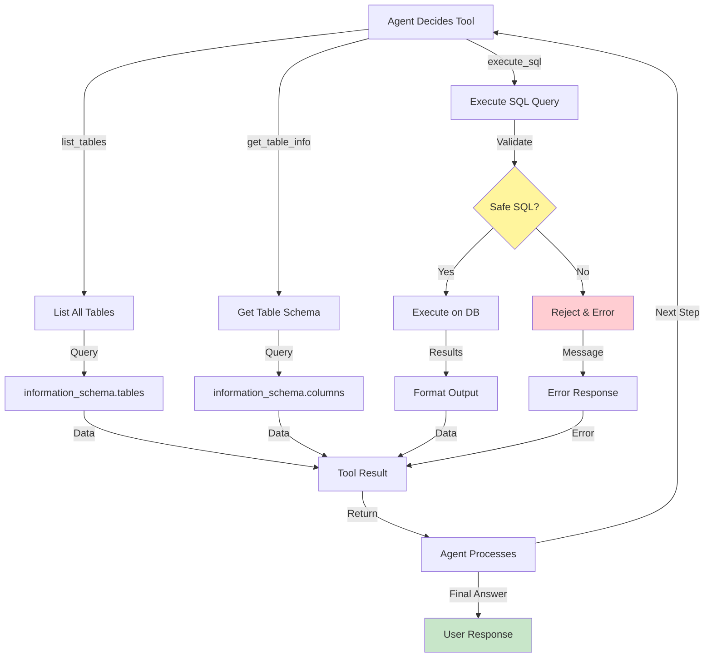

## Environment Variables Flow

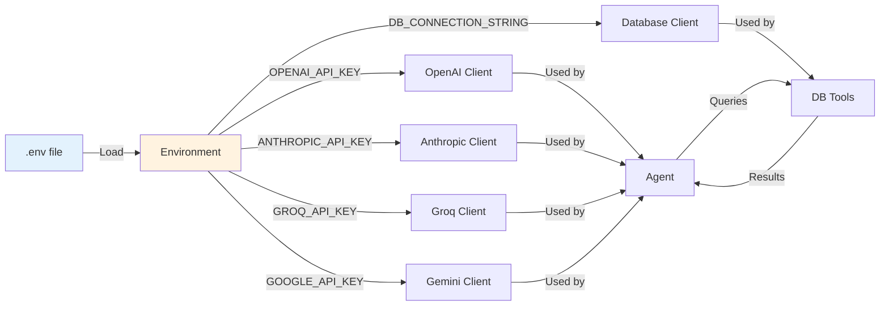

## Error Handling Flow

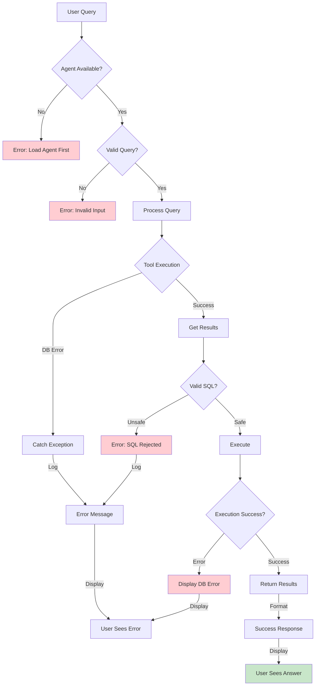

## Streaming Architecture

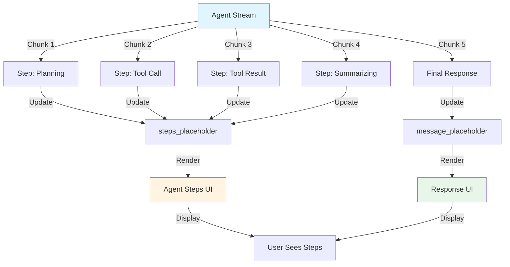

## Summary

The NLDBQ application follows a **layered architecture** with clear separation of concerns:

1. **Presentation Layer**: Streamlit UI handles user interaction and displays results
2. **Agent Layer**: LangGraph agent orchestrates the query processing workflow
3. **Tool Layer**: Database tools provide safe schema inspection and SQL execution
4. **Data Layer**: Database client manages connections and executes queries
5. **Configuration Layer**: Manages LLM providers, prompts, and system settings

Data flows **unidirectionally** from user input through the agent workflow to the database and back, with each layer responsible for specific transformations and validations.
