# NLDBQ Data Flow Diagram

## High-Level Architecture

```mermaid
graph TB
    User[👤 User] -->|Natural Language Query| UI[🖥️ Streamlit UI]
    UI -->|Initialize Agent| AM[🤖 Agent Manager]
    AM -->|Create Agent| AF[🏭 Agent Factory]
    AF -->|Select LLM| LLM[🧠 LLM Provider]
    
    UI -->|Stream Query| Agent[🤖 NLDBQ Agent]
    Agent -->|Use Tools| Tools[🔧 DB Tools]
    Tools -->|Query Schema| Schema[📊 Schema Wrapper]
    Schema -->|Connect| DB[🗄️ Database]
    
    Agent -->|Generate SQL| Validator[✅ SQL Validator]
    Validator -->|Execute Safe SQL| DB
    DB -->|Results| Agent
    Agent -->|Stream Steps & Response| UI
    UI -->|Display| User
    
    style User fill:#e1f5ff
    style UI fill:#fff4e1
    style Agent fill:#e8f5e9
    style DB fill:#fce4ec
    style LLM fill:#f3e5f5
```



## Detailed Data Flow

```mermaid
sequenceDiagram
    participant U as 👤 User
    participant UI as 🖥️ Streamlit UI
    participant AM as 🤖 Agent Manager
    participant A as 🤖 Agent
    participant T as 🔧 Tools
    participant S as 📊 Schema Wrapper
    participant DB as 🗄️ Database
    participant LLM as 🧠 LLM
    
    U->>UI: Enter natural language query
    UI->>UI: Add to chat history
    
    Note over UI,AM: Agent Initialization (if needed)
    UI->>AM: get_agent(provider, model)
    AM->>LLM: Initialize LLM client
    AM->>T: Get DB tools
    AM-->>UI: Return configured agent
    
    Note over UI,A: Query Processing
    UI->>A: stream(query, config)
    A->>A: Step 01: Planning next steps
    
    Note over A,DB: Schema Discovery Phase
    A->>T: list_tables()
    T->>S: get_all_tables()
    S->>DB: SELECT table_name FROM information_schema
    DB-->>S: Table list
    S-->>T: Formatted table info
    T-->>A: Available tables
    A->>UI: Step 02: Found tables
    
    A->>T: get_table_info(table_name)
    T->>S: get_table_schema(table_name)
    S->>DB: SELECT column details
    DB-->>S: Column metadata
    S-->>T: Schema details
    T-->>A: Table structure
    A->>UI: Step 03: Analyzing schema
    
    Note over A,LLM: SQL Generation Phase
    A->>LLM: Generate SQL based on schema + query
    LLM-->>A: SQL query
    A->>A: Validate SQL (no DROP/DELETE/etc)
    A->>UI: Step 04: Generated SQL query
    
    Note over A,DB: Execution Phase
    A->>T: execute_sql(query)
    T->>S: execute_query(sql)
    S->>DB: Execute SQL
    DB-->>S: Query results
    S-->>T: Formatted results
    T-->>A: Result set
    A->>UI: Step 05: Found N results
    
    Note over A,LLM: Response Generation
    A->>LLM: Summarize results
    LLM-->>A: Natural language summary
    A->>UI: Step 06: Summarizing findings
    
    A->>UI: Final response with results
    UI->>U: Display answer + SQL + results
    UI->>UI: Save to query history
```



## Component Breakdown

### 1. **User Interface Layer** (`src/ui/`)


**Data Flow:**
- User input → Session state
- Session state → Agent manager
- Agent responses → UI components
- Query history → Sidebar display

### 2. **Agent Layer** (`src/agents/`)


**Data Flow:**
- Natural language → Agent
- Agent → Tool selection
- Tools → Database operations
- Results → Natural language response

### 3. **Database Layer** (`src/db/`)


**Data Flow:**
- Schema requests → information_schema queries
- SQL execution → Database
- Results → Formatted output
- Connection management → Pool

### 4. **Configuration Layer** (`src/config/`)


### 5. **Agent Steps Flow**


## Data Structures

### Query Processing Data Flow
```
Input: Natural Language String
  ↓
Agent State: {
  messages: [HumanMessage, AIMessage, ToolMessage],
  thread_id: "conversation_1",
  config: {...}
}
  ↓
Tool Calls: {
  name: "list_tables" | "get_table_info" | "execute_sql",
  args: {...},
  results: {...}
}
  ↓
LLM Response: {
  content: "Natural language answer",
  tool_calls: [...],
  type: "ai"
}
  ↓
Output: Formatted Response + SQL + Results
```

### Session State Structure
```
st.session_state = {
  messages: [
    {role: "user", content: "..."},
    {role: "assistant", content: "..."}
  ],
  query_history: [
    {
      question: "...",
      sql: "SELECT ...",
      timestamp: datetime
    }
  ],
  agent: Agent,
  current_agent_key: "provider:model",
  config: {
    configurable: {
      thread_id: "..."
    }
  }
}
```

## Tool Execution Flow


## Environment Variables Flow


## Error Handling Flow


## Streaming Architecture


## Summary

The NLDBQ application follows a **layered architecture** with clear separation of concerns:

1. **Presentation Layer**: Streamlit UI handles user interaction and displays results
2. **Agent Layer**: LangGraph agent orchestrates the query processing workflow
3. **Tool Layer**: Database tools provide safe schema inspection and SQL execution
4. **Data Layer**: Database client manages connections and executes queries
5. **Configuration Layer**: Manages LLM providers, prompts, and system settings

Data flows **unidirectionally** from user input through the agent workflow to the database and back, with each layer responsible for specific transformations and validations.
